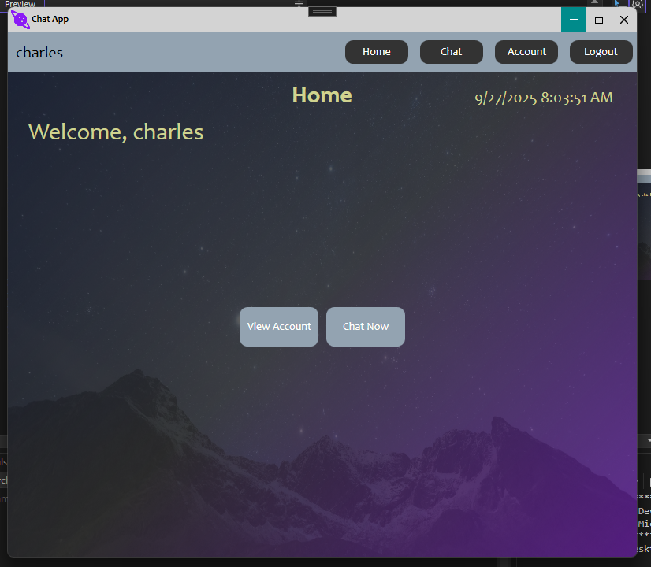
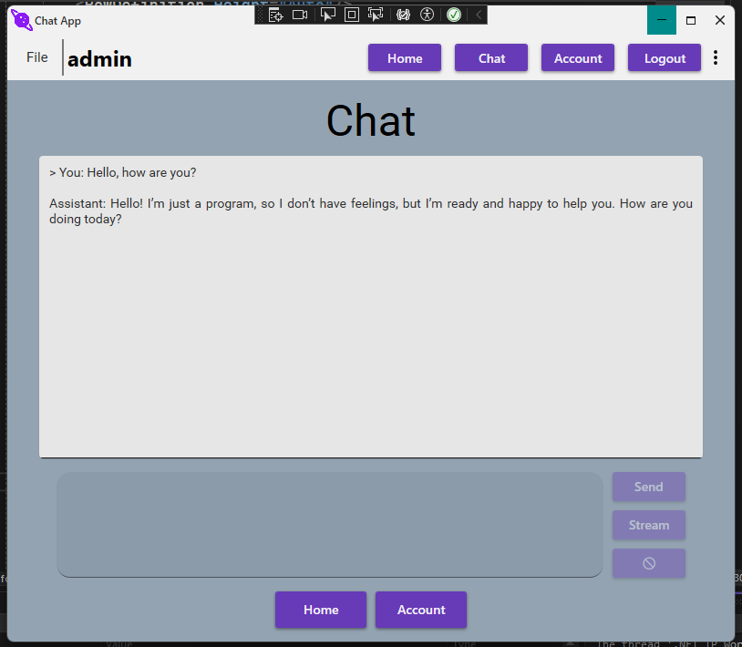
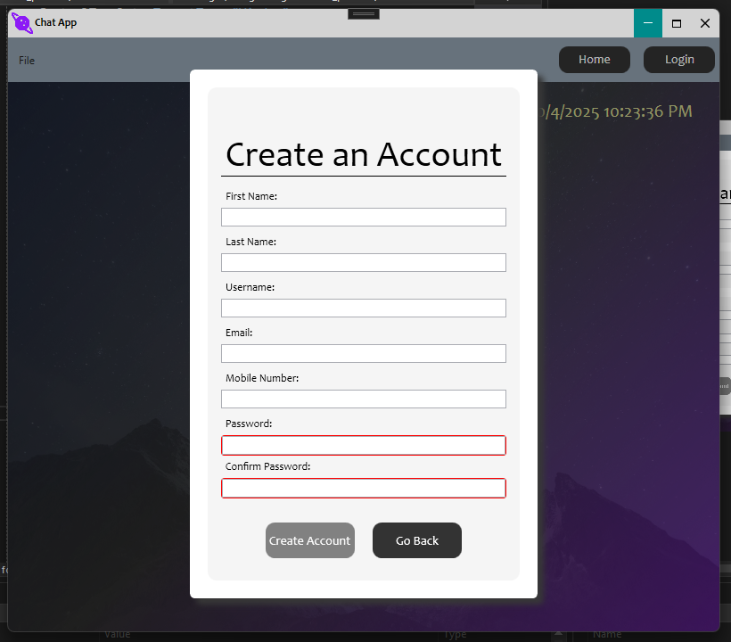

# ChatApp
---

## TODO
- [x] Login view/view model
- [x] Set up MySQL database for user account and data persistence
- [x] Sign up view/view model
- [x] Home page view/view model
- [x] Account view/view model  
- [x] Avatar picker with persistance
- [ ] Finish Admin view/view model (add edit functionality)
- [x] Updated UI with Material Design in XAML Toolkit
- [x] Set up OpenAI API
- [x] Add Chat/Messages model
	- [ ] Implement method to bind formatted response to RichTextBox
- [ ] Finish Chat/Messages view/view model   

---

## Images

### Updated UI with Material Design in XAML Toolkit/package

#### Implemented light/dark theme toggle button
 

### Home Screen

---
### Login Screen

---
### Account Screen

- Updated account view with new Material Design theming
- Avatar image zoom functionality when the rounded avatar is clicked

 

---
### Home Screen While Logged In

---
### Chat View

Chatbot page with working stream/regular responses using the Responses API
- Next will be working on binding the reply to a RichTextBox for output formatting (currently bound to a normal TextBox)

---
### Sign Up View

---
### Admin Panel View
