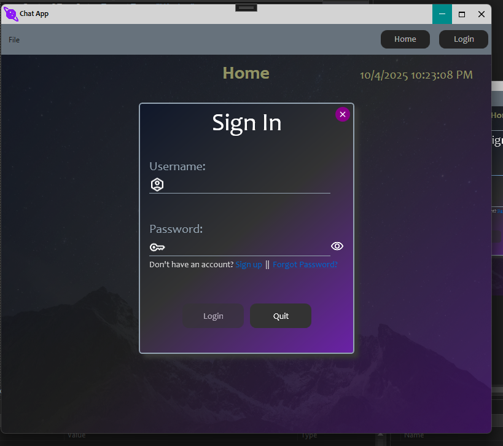
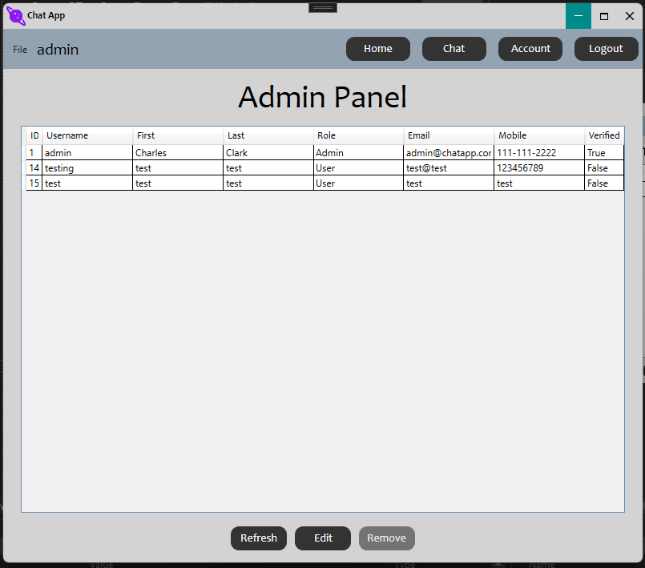

# ChatApp
---

## TODO
- [x] Login view/view model
- [x] Set up MySQL database for user account and data persistence
- [x] Sign up view/view model
- [x] Home page view/view model
- [x] Account view/view model  
- [x] Avatar picker with persistance
- [ ] Finish Admin view/view model (add edit functionality)
- [ ] Set up OpenAI API
- [ ] Add Chat/Messages model
- [ ] Finish Chat/Messages view/view model   

---

## Images

### Home Screen

---
### Login Screen

---
### Account Screen

---
### Home Screen While Logged In

---
### Chat View

---
### Sign Up View

---
### Admin Panel View
